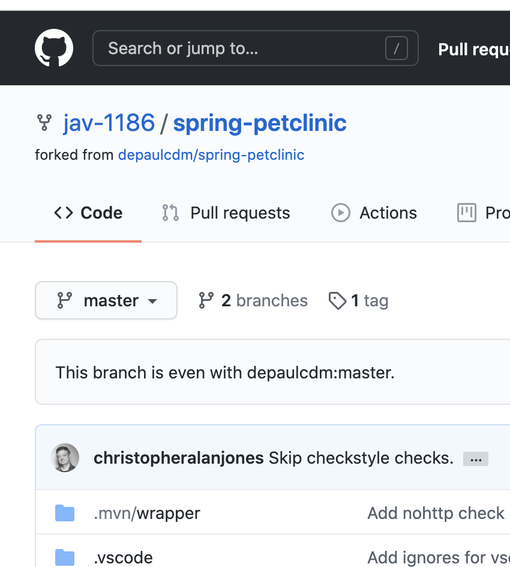
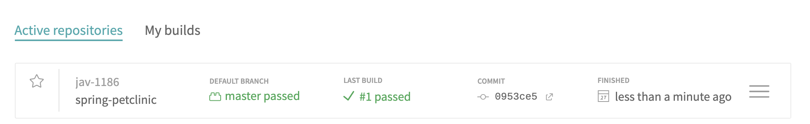
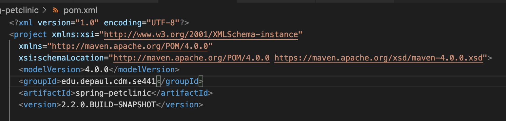

Your Github account showing that is has been forked from the depaulcdm/springpetclinic repository.

Your Travis CI dashboard showing a successful first build.

The section of the POM file showing the coordinates after you’ve changed them

Your Travis CI dashboard showing a successful build after your change of the group
ID.

