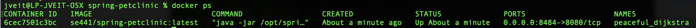
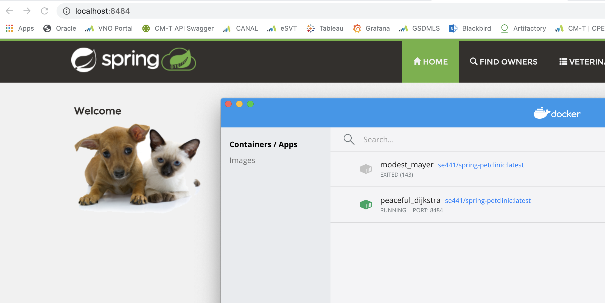
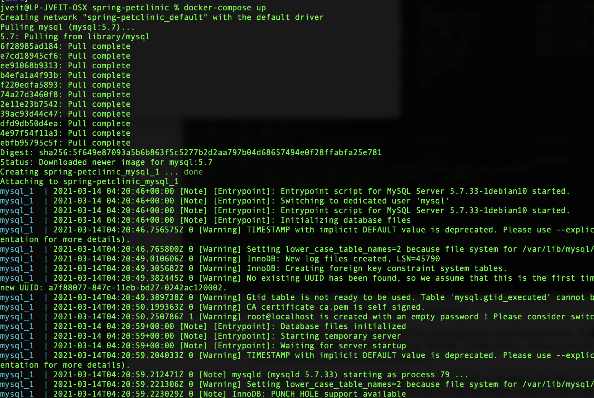
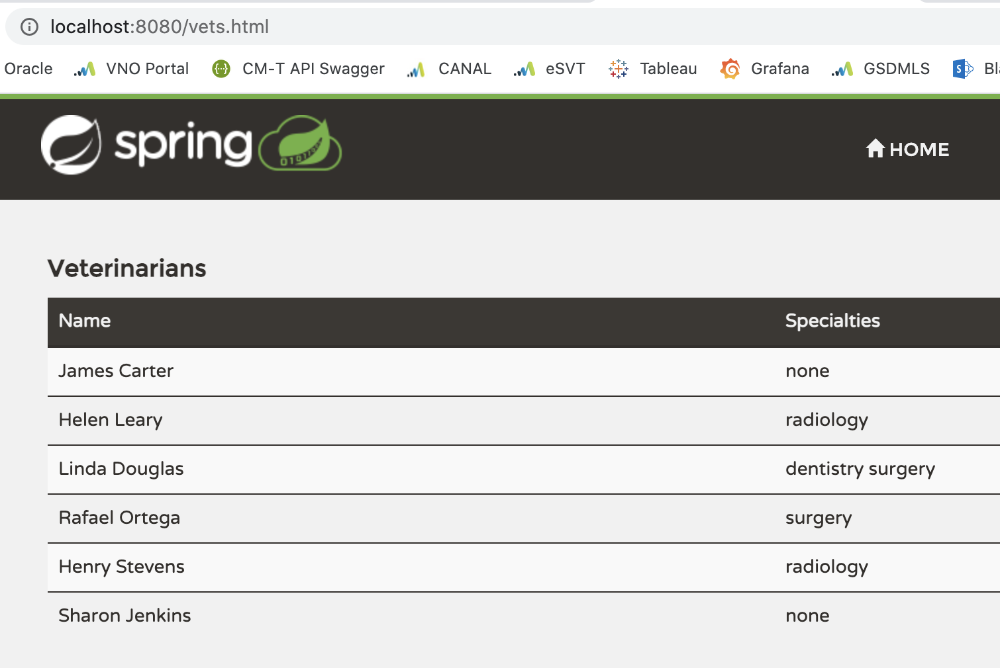
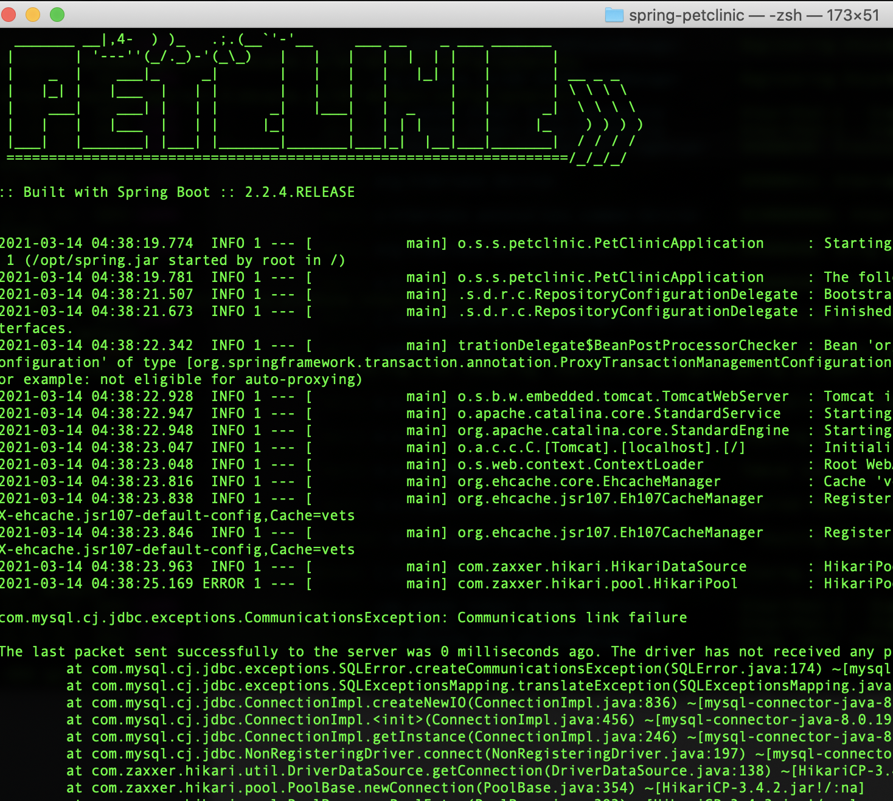
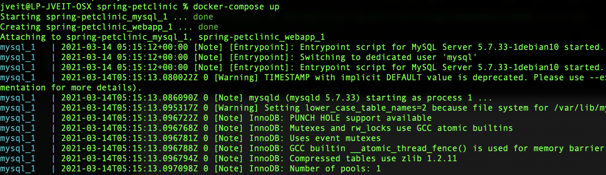
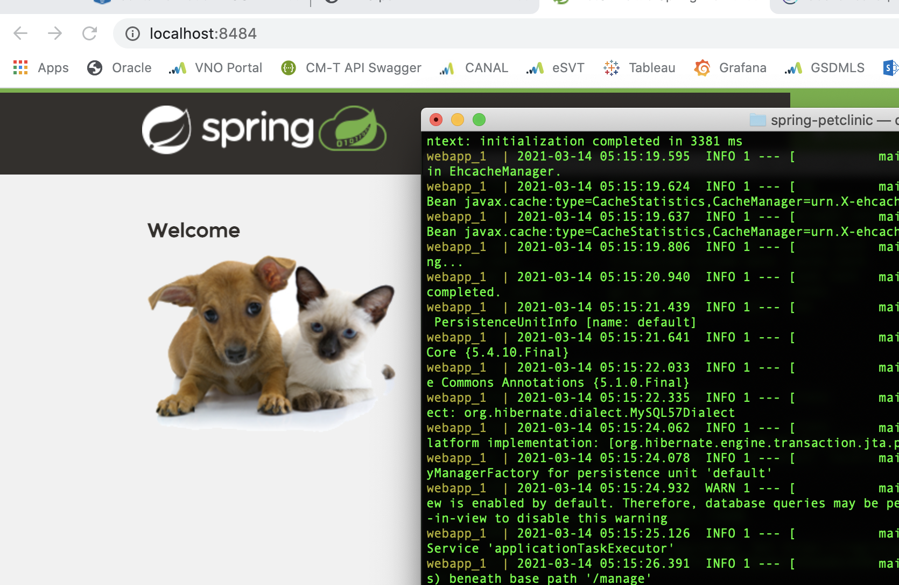

Your Github account showing that is has been forked from the depaulcdm/springpetclinic repository.

Your Travis CI dashboard showing a successful first build.

The section of the POM file showing the coordinates after you’ve changed them

Your Travis CI dashboard showing a successful build after your change of the group
ID.

The section of the POM file showing the coordinates after you’ve commented them
out.

Your Travis CI dashboard showing the unsuccessful build after the breaking change.

Your Github repository with the readme.md file selected showing the build failed
status after the Travis CI build fails.

The section of the POM file showing the coordinates after you’ve fixed them.

Your Travis CI dashboard showing the successful build after the breaking change has
been fixed.

Your Github repository with the readme.md file selected showing the build success
status after the Travis CI build has recovered.

HW8

Your dockerfile. Please provide a link to this file rather than a screen capture.

Link

Your running docker instance as shown by a ps command.

Your browser accessing the main page of the website from your local container.

The output from the docker-compose up command.

Your browser accessing the “Veterinarians” page of the website from your local container when you run the application from the host system.

A section of the stack trace generated when you attempt to run the application
container that has been updated to use MySQL.

Your updated docker-compose.yml file containing the application server, built from
your local Dockerfile, and the existing MySQL configuration. Please provide a link
to this file rather than a screen capture.

link

Your updated application-mysql.properties file containing the URL change for
the database server. Please provide a link to this file rather than a screen capture.

link

The output from the docker-compose up command.

Your browser accessing the “Veterinarians” page of the website from your local container.

